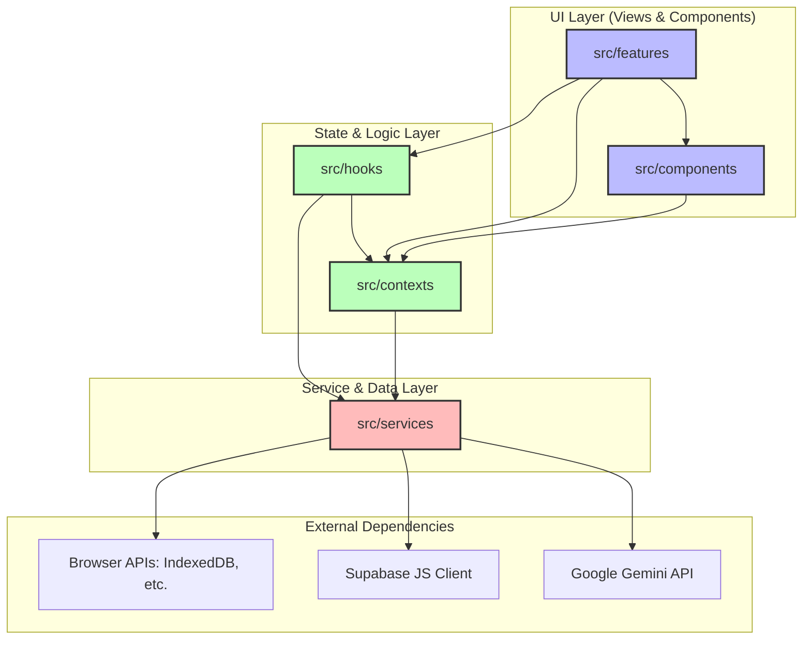
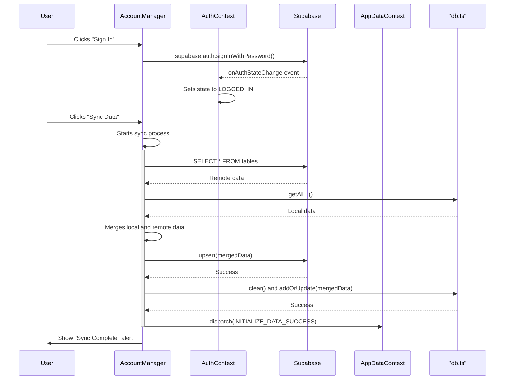

# Architecture Documentation: Japanese Sentence Analyzer

**arc42 Template Version:** 9.0 (adapted for this project)
**Last Updated:** 2025-07-11

This document provides a comprehensive overview of the architecture for the Japanese Sentence Analyzer, a web-based tool for linguistic analysis and language learning.

## 1. Introduction and Goals

### 1.1. Requirements Overview

The application is a client-side tool designed for Japanese language learners. Its primary purpose is to provide deep linguistic analysis of Japanese text and facilitate learning through a Spaced Repetition System (SRS).

**Core Features:**
-   **Text Input:** Users can input or paste Japanese text for analysis, or import article content from a URL.
-   **AI-Powered Analysis:** Leverages the Google Gemini API to break down sentences into morphological segments, providing readings (furigana), pitch accent, parts of speech, and English equivalents.
-   **Grammar Identification:** The AI identifies and explains grammatical patterns and idiomatic expressions within the text.
-   **Interactive UI:** Users can click on words and grammar patterns to get detailed information. Drill down further with in-app **Kanji analysis** (meanings, readings, stroke count, examples) and **deep word analysis** (definitions, example sentences), all powered by the Gemini API.
-   **AI Comprehension Quiz**: After reading a paragraph or a full text, users can take an AI-generated multiple-choice quiz to test their reading comprehension. The AI also estimates the JLPT difficulty level of the text.
-   **Spaced Repetition System (SRS):** Users can add words and grammar patterns to a review deck. The application uses an interactive SRS to schedule items for review, testing users with different quiz types (e.g., translation, reading) to enhance long-term memory retention. The "My Texts" list provides an at-a-glance view of which texts have items due for review.
-   **Focused Reading Mode:** A focused, sentence-by-sentence reading interface to minimize distractions.
-   **Persistence & Offline Capability:** All user data is stored locally in the browser's IndexedDB. The application is a Progressive Web App (PWA), meaning its interface is available offline and can be "installed" on user devices.
-   **Optional Cloud Sync:** Users can create an account and sign in to synchronize their texts and review deck across devices using Supabase as a backend.

### 1.2. Quality Goals

| Quality Goal      | Motivation                                                                                                   | How it's Achieved                                                                                                                                                                                              |
| ----------------- | ------------------------------------------------------------------------------------------------------------ | -------------------------------------------------------------------------------------------------------------------------------------------------------------------------------------------------------------- |
| **Usability**     | The primary users are language learners. The interface must be intuitive, responsive, and helpful.           | Clean, component-based UI. Responsive design (e.g., BottomSheet on mobile, Tooltip on desktop). Hotkeys for power users. Clear visual hierarchy. At-a-glance status indicators (e.g., due review counts). Dark/Light themes. Adjustable font sizes.                |
| **Performance**   | API calls can be slow and costly. The app must feel fast and responsive during use.                          | **Caching:** All sentence analyses from the Gemini API are cached in IndexedDB. **Prefetching:** In Reading Mode, the next sentence's analysis is fetched in the background. Lightweight state management.      |
| **Maintainability** | The codebase must be easy to understand, modify, and extend over time.                                      | **TypeScript:** Enforces type safety. **Component-Based:** Code is modularized into React components. **Structured Code:** Code is organized by `features`, `services`, `contexts`, `hooks`, and `utils`. **Unit Tests** for core logic and UI components via Vitest. |
| **Offline Capability** | Users should be able to use the app interface and review their saved data without an internet connection. | All user data is stored in **IndexedDB**. A **Service Worker** caches all static assets (HTML, JS, CSS, icons), making the application shell fully available offline. New analyses still require an internet connection. |
| **Configurability**| Users should be able to tailor the experience to their needs, including providing their own API keys.      | A comprehensive settings menu allows toggling UI features, adjusting learning parameters (e.g., new words per day), and managing API keys and Supabase credentials.                                                   |
| **Data Sync**     | Users may use multiple devices and expect their data to be available on all of them.                         | Optional integration with **Supabase** allows for user authentication and cloud synchronization of all text entries and review items. A "last-write-wins" or merge strategy keeps data consistent. |

### 1.3. Stakeholders

| Role                  | Goals & Interests                                                                                             |
| --------------------- | ------------------------------------------------------------------------------------------------------------- |
| **Language Learner**  | (Primary User) Needs an accurate, fast, and easy-to-use tool to understand Japanese and practice vocabulary. Wants their data saved and potentially available on multiple devices. |
| **AI-Assisted Developer** | (Primary Developer) A human developer collaborating with a large language model to produce a clean, well-structured, and maintainable codebase. |
| **App "Host"/Provider**| If deployed for public use, needs to manage API costs, potentially by requiring users to provide their own key. |

### 1.4. Development Process Note

A significant aspect of this project's development is the use of **AI-Assisted Development**. The entire application, from initial architecture to feature implementation and debugging, was created through a collaborative process between a human engineer and a large language model from Google. This approach influences the "Developer" stakeholder role and demonstrates a modern workflow for rapid application development.

---

## 2. Architecture Constraints

### Technical Constraints

-   **Client-Side Logic:** The application is a Single-Page Application (SPA) that runs entirely in the user's web browser. All core UI and business logic resides on the client.
-   **Browser Environment:** Must be compatible with modern web browsers that support the Fetch API, **IndexedDB**, Service Workers, and Supabase JS Client.
-   **Gemini API Dependency:** The core analysis functionality is critically dependent on the Google Gemini API.
-   **Optional Backend-as-a-Service (BaaS):** The application uses Supabase for optional authentication and data storage. This is a managed service, so the application does not have its own custom backend server.
-   **Technology Stack:** The architecture is built on and constrained by the chosen technologies: React, TypeScript, and Tailwind CSS.

### Organizational Constraints

-   **API Key Management:** The system is designed to work with a default key provided via environment variables (`process.env.API_KEY`) or a user-provided key. This design suggests a need to offload API costs to the user in a self-hosted or "power-user" scenario. Supabase usage also falls under a free tier, but could incur costs at scale.

---

## 3. Context and Scope

### Business Context

The system is a standalone web application. It interacts with external services for its core logic and data persistence.

| System/User          | Responsibilities                                                                        |
| -------------------- | --------------------------------------------------------------------------------------- |
| **Language Learner** | Interacts with the UI to input text, review analyses, manage learning, and optionally sign in. |
| **Japanese Analyzer SPA** | Renders the UI, manages state, orchestrates API calls, and handles local/remote persistence. |
| **Google Gemini API**  | (External) Provides the core linguistic analysis based on prompts from the SPA.        |
| **Supabase**         | (External) Provides authentication, a PostgreSQL database, and auto-generated APIs for data sync. |
| **Browser APIs**     | (External) Provide **IndexedDB**, `SpeechSynthesis`, and **Service Workers**.        |

### Technical Context

-   **UI:** The user interacts with a React-based UI rendered in their browser.
-   **Data Flow for Analysis:** `UI -> Gemini Service -> Google Gemini API -> Gemini Service -> Data Cache (in IndexedDB) -> UI`
-   **Data Flow for Persistence:**
    -   **Local:** `UI -> AppData Context -> DB Service -> IndexedDB`
    -   **Cloud (when logged in):** `UI -> AppData Context (Synced Dispatch) -> Supabase JS Client -> Supabase Backend`

---

## 4. Solution Strategy

### Technology Choices

-   **React:** Chosen for its component-based architecture, which allows for building a modular and maintainable UI.
-   **TypeScript:** Used to add static typing, improving code quality, developer experience, and long-term maintainability.
-   **Tailwind CSS:** A utility-first CSS framework used for rapid and consistent styling.
-   **Vite:** A modern frontend build tool that provides a fast development experience and optimized production builds.
-   **Vitest:** A modern unit testing framework chosen for its speed and seamless integration with Vite.
-   **Google Gemini API (`@google/genai`):** The cornerstone of the application's analysis features, chosen for its advanced natural language understanding and ability to return structured JSON.
-   **Supabase:** Chosen as the optional Backend-as-a-Service (BaaS). It provides a simple, integrated solution for authentication, a PostgreSQL database with Row Level Security, and an auto-generated RESTful API via its JavaScript client library. This avoids the need to build and maintain a custom backend.
-   **IndexedDB:** Chosen as the primary *local* persistence solution for its high storage capacity, asynchronous API, and strong support for structured data. It serves as the offline cache and the primary data store for users who opt out of cloud sync.
-   **PWA Technologies (Service Workers, Web App Manifest):** Chosen to provide offline access to the application shell and allow users to "install" the app on their devices.

### Key Architectural Decisions

-   **Centralized State Management via React Context:** The application uses React's Context API. The state is strategically divided into four contexts (`AppData`, `Settings`, `UI`, `Auth`) to prevent unnecessary re-renders and keep concerns separated.
-   **Service-Oriented Structure:** Logic for external interactions is isolated in `src/services`. This includes `gemini.ts` (Gemini API), `supabase.ts` (Supabase client creation), and `db.ts` (IndexedDB interactions). This separation makes core components more focused and testable.
-   **Hook-based Logic Abstraction:** Complex or reusable logic is encapsulated in custom hooks (e.g., `useSentenceAnalysis`, `useHotkeys`, `useAuth`).
-   **Optional Cloud Sync Model:** The application is architected to function perfectly offline with IndexedDB. Supabase integration is an optional layer that users can enable via the settings. The `AuthContext` and synced dispatch in `AppDataContext` handle this optionality gracefully.
-   **Synced Dispatch for Automatic Push:** To keep cloud data current, the `appDataContext` uses a wrapped `dispatch` function. After the local state is updated optimistically, this function checks if the user is logged in and, if so, pushes the same change to the Supabase backend. This automates the sync-out process.
-   **Manual Merge for Initial Sync:** The first time a user logs in on a device with existing local data, a manual "Sync" action triggers a merge process that combines local and remote data to create a unified state, which is then persisted to both locations.

---

## 5. Building Block View

### Level 1: Key Logical Components

```mermaid
graph TD
    subgraph Browser
        UI(User Interface)
        State(State Management)
        Services(Service Layer)
        Persistence(Local Persistence via db.ts)
    end

    subgraph External
        GeminiAPI[Google Gemini API]
        Supabase[Supabase - Auth & DB]
        BrowserAPIs[Browser APIs - IndexedDB, etc.]
    end

    UI --> State
    UI --> Services
    State --> UI
    State --> Persistence
    State --> Services # For synced dispatch
    Services --> GeminiAPI
    Services --> Supabase
    Persistence --> BrowserAPIs

    style UI fill:#bbf,stroke:#333,stroke-width:2px
    style State fill:#bfb,stroke:#333,stroke-width:2px
    style Services fill:#fbb,stroke:#333,stroke-width:2px
    style Persistence fill:#ffb,stroke:#333,stroke-width:2px
```

### Level 2: High-Level Code Dependencies



---

## 6. Runtime View

### Scenario: User Signs In and Syncs Data

1.  **User**: Opens Settings, enters Supabase credentials, and saves them.
2.  **`SettingsMenu`**: Dispatches `UPDATE_SETTINGS`. `settingsContext` updates and saves to IndexedDB.
3.  **`authContext`**: Its `useEffect` hook, depending on `settingsState`, detects the new credentials and creates a new `SupabaseClient` instance. It sets its `authState` to `INITIALIZING`.
4.  **`authContext`**: It calls `supabase.auth.getSession()` and subscribes to `onAuthStateChange`. Since there's no session, it transitions to `LOGGED_OUT`.
5.  **`AccountManager`**: Renders a "Sign In / Sign Up" button. User clicks it.
6.  **User**: Enters email/password in the modal and clicks "Sign In".
7.  **`AccountManager`**: Calls `supabase.auth.signInWithPassword()`.
8.  **Supabase**: Authenticates the user and returns a session.
9.  **`authContext`**: The `onAuthStateChange` listener fires. The context updates its state with the new `user` and `session`, and sets `authState` to `LOGGED_IN`.
10. **`AccountManager`**: Re-renders to show the user's email and the "Sync Data" button.
11. **User**: Clicks "Sync Data".
12. **`AccountManager`**: Calls the `syncData` function.
13. **`syncData` Function**:
    -   Fetches all remote data from Supabase for the current `user.id`.
    -   Fetches all local data from IndexedDB via `db.ts`.
    -   Performs a merge operation, creating a unified dataset.
    -   Upserts the merged data back to Supabase.
    -   Clears and writes the merged data back to IndexedDB.
    -   Dispatches an `INITIALIZE_DATA_SUCCESS` action to `appDataContext` to refresh the entire app state with the merged data.
14. **User**: Sees a confirmation alert, and the UI now reflects the combined local and cloud data.



---

## 7. Deployment View

This remains a static single-page application. The addition of Supabase does not change the deployment model.

### Build Process

-   Unchanged. The command `yarn build` (invoking `vite build`) bundles all assets into the `/dist` directory.

### Deployment Infrastructure

-   Unchanged. The contents of the `/dist` directory are deployed to a static web hosting service.
-   **Additional Requirement**: A Supabase project must be created and its database schema initialized using `supabase_schema.sql`.

---

## 8. Crosscutting Concepts

| Concept                 | Implementation Strategy                                                                                                                                                                                                                                                                                        |
| ----------------------- | -------------------------------------------------------------------------------------------------------------------------------------------------------------------------------------------------------------------------------------------------------------------------------------------------------------- |
| **State Management**    | Implemented via React Context API (`AppData`, `Settings`, `UI`, `Auth`).                                                                                                                                                                                                                                       |
| **Authentication**      | Centralized in `authContext.tsx`. This context manages the Supabase client instance, listens to auth events, and provides the user's auth state to the rest of the app. UI components for auth are in `AccountManager.tsx`.                                                                                       |
| **Data Synchronization**| **Push:** A "synced dispatch" wrapper in `appDataContext.tsx` automatically sends local changes to Supabase if the user is logged in. **Pull/Merge:** A manual sync function in `AccountManager.tsx` handles the initial data merge.                                                                              |
| **Persistence**         | The app uses a dual-persistence strategy. **`IndexedDB`** is the primary, always-on local store. **Supabase** is the optional, remote store for cloud backup and sync. The `db.ts` service abstracts all IndexedDB operations.                                                                                        |
| **Error Handling**      | `useApiCall` hook for Gemini. Supabase errors from sync or auth are caught in `AccountManager` and displayed to the user via modals/alerts.                                                                                                                                                                      |

---

## 9. Architecture Decisions

### ADR 1: State Management with React Context

-   **Decision:** Use React's built-in Context API for state management.
-   **Status:** Unchanged. The addition of an `AuthContext` follows this established pattern.

### ADR 2: Client-Side Persistence with `IndexedDB`

-   **Decision:** Use `IndexedDB` for all *local* data persistence.
-   **Status:** Unchanged. IndexedDB remains critical for offline functionality and for users who do not opt-in to cloud sync.

### ADR 3: Gemini for Linguistic Analysis with Strict Schemas

-   **Decision:** Use the Google Gemini API as the analysis engine and enforce a strict JSON output schema.
-   **Status:** Unchanged.

### ADR 4: Optional Cloud Sync with Supabase

-   **Decision:** Add Supabase as an optional Backend-as-a-Service for authentication and data synchronization.
-   **Rationale:** Provides a complete backend solution (Auth, DB, APIs) with a generous free tier, avoiding the need to build and maintain a custom server. Its client-side JS library integrates well with the existing SPA architecture. Making it optional preserves the app's core offline-first, serverless nature for users who don't need sync.
-   **Consequences:** Adds a dependency on the Supabase service. Introduces complexity related to data merging and managing auth state. Requires users to create an account for sync features.

---

## 10. Quality Requirements

-   The addition of the "Data Sync" quality goal has been met. All other goals remain as they were.

---

## 11. Risks and Technical Debt

### Identified Risks

-   **API Key Exposure/Management:** (Existing)
-   **Gemini API Changes/Costs:** (Existing)
-   **CORS Proxy Reliability:** (Existing)
-   **Supabase Service Dependency:** The application's sync and auth features are now dependent on Supabase. Downtime or breaking changes in the Supabase service will affect logged-in users.
-   **Data Merge Conflicts:** The current merge strategy ("last updated wins" for texts, remote-wins for deck) is simple. In rare edge cases (simultaneous offline edits on two devices followed by a sync), data could be overwritten. A more sophisticated CRDT-based approach is out of scope due to its complexity.

---

## 12. Glossary

| Term                    | Definition                                                                                                        |
| ----------------------- | ----------------------------------------------------------------------------------------------------------------- |
| **BaaS**                | Backend-as-a-Service. A cloud service model where developers outsource backend aspects of web/mobile apps.          |
| **RLS**                 | Row Level Security. A PostgreSQL feature used by Supabase to restrict which data rows a user can access.          |
| **Supabase**            | An open-source Firebase alternative that provides a suite of backend tools, including auth and a database.        |
| **Synced Dispatch**     | A wrapper around the React state dispatcher that also sends the action's payload to a remote backend.             |
(Other terms remain the same)
| **Analysis**            | The structured JSON object returned by the Gemini API, detailing a sentence's linguistic properties.              |
| **Context**               | Refers to the React Context API used for state management. The app has `AppData`, `Settings`, and `UI` contexts.    |
| **CORS**                | Cross-Origin Resource Sharing. A browser security feature that restricts web pages from making requests to a different domain than the one that served the page. |
| **Furigana**              | Hiragana readings placed above kanji characters.                                                                  |
| **IndexedDB**             | A low-level browser API for client-side storage of significant amounts of structured data, including files/blobs. |
| **Pitch Accent**          | The rise and fall of pitch in Japanese words, represented in the app by 'H' and 'L' strings.                       |
| **PWA**                   | Progressive Web App. A web application that uses modern web capabilities to deliver an app-like experience to users. Features include offline work, installability, and push notifications. |
| **Review Item**           | A single word or grammar point stored in the review deck for SRS.                                                   |
| **Segment**               | A single morphological unit (word, particle) of a sentence as determined by the analysis.                         |
| **Service Worker**        | A script that the browser runs in the background, separate from a web page, enabling features that don't need a web page or user interaction, like offline caching and push notifications. |
| **SPA**                   | Single-Page Application. A web application that runs entirely on a single HTML page.                              |
| **SRS**                   | Spaced Repetition System. An evidence-based learning technique that schedules reviews at increasing intervals.    |
| **TextEntry**             | A data structure representing a user-saved text, including its title, content, and cached sentence analyses.      |
| **View**                  | A top-level UI screen in the application, such as `EditorView`, `ReaderView`, or `ReviewController`.              |