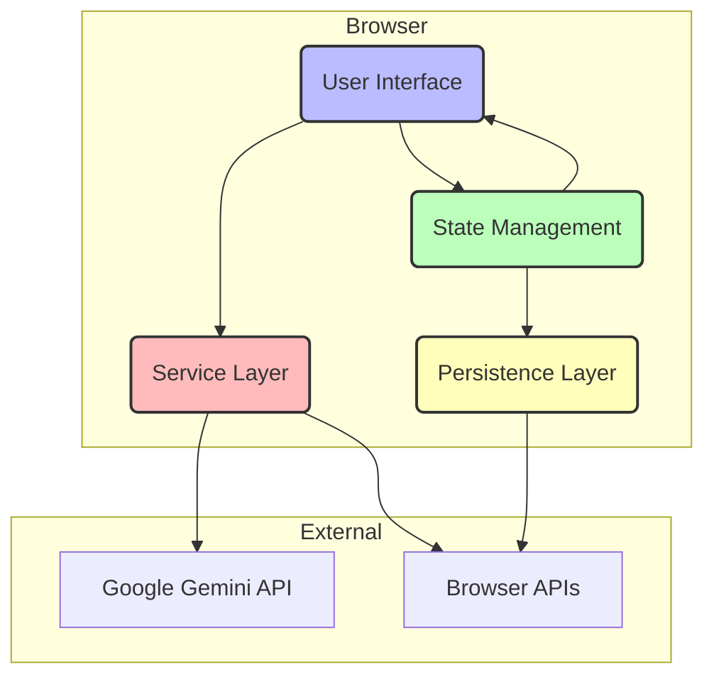

# Architecture Documentation: Japanese Sentence Analyzer

**arc42 Template Version:** 9.0 (adapted for this project)
**Last Updated:** 2024-05-21

This document provides a comprehensive overview of the architecture for the Japanese Sentence Analyzer, a web-based tool for linguistic analysis and language learning.

## 1. Introduction and Goals

### 1.1. Requirements Overview

The application is a client-side tool designed for Japanese language learners. Its primary purpose is to provide deep linguistic analysis of Japanese text and facilitate learning through a Spaced Repetition System (SRS).

**Core Features:**
-   **Text Input:** Users can input or paste Japanese text for analysis.
-   **AI-Powered Analysis:** Leverages the Google Gemini API to break down sentences into morphological segments, providing readings (furigana), pitch accent, parts of speech, and English equivalents.
-   **Grammar Identification:** The AI identifies and explains grammatical patterns and idiomatic expressions within the text.
-   **Interactive UI:** Users can click on words and grammar patterns to get detailed information.
-   **Spaced Repetition System (SRS):** Users can add words and grammar patterns to a review deck. The application uses an SRS algorithm to schedule items for review to enhance long-term memory retention.
-   **Reading Mode:** A focused, sentence-by-sentence reading interface to minimize distractions.
-   **Persistence:** All user data, including saved texts, analysis caches, and review progress, is stored locally in the browser.

### 1.2. Quality Goals

| Quality Goal      | Motivation                                                                                                   | How it's Achieved                                                                                                                                                                                              |
| ----------------- | ------------------------------------------------------------------------------------------------------------ | -------------------------------------------------------------------------------------------------------------------------------------------------------------------------------------------------------------- |
| **Usability**     | The primary users are language learners. The interface must be intuitive, responsive, and helpful.           | Clean, component-based UI. Responsive design (e.g., BottomSheet on mobile, Tooltip on desktop). Hotkeys for power users. Clear visual hierarchy. Dark/Light themes. Adjustable font sizes.                |
| **Performance**   | API calls can be slow and costly. The app must feel fast and responsive during use.                          | **Caching:** All sentence analyses from the Gemini API are cached in `localStorage`. **Prefetching:** In Reading Mode, the next sentence's analysis is fetched in the background. Lightweight state management. |
| **Maintainability** | The codebase must be easy to understand, modify, and extend over time.                                      | **TypeScript:** Enforces type safety. **Component-Based:** Code is modularized into React components. **Structured Code:** Code is organized by `features`, `services`, `contexts`, `hooks`, and `utils`. |
| **Offline Capability** | Users should be able to review their saved texts and analyses without an internet connection.                  | All user data, including cached analyses, is stored in `localStorage`, making previously viewed content available offline. New analyses require an internet connection.                                   |
| **Configurability**| Users should be able to tailor the experience to their needs, including providing their own API keys.      | A comprehensive settings menu allows toggling UI features, adjusting learning parameters (e.g., new words per day), and managing the API key.                                                   |

### 1.3. Stakeholders

| Role                  | Goals & Interests                                                                                             |
| --------------------- | ------------------------------------------------------------------------------------------------------------- |
| **Language Learner**  | (Primary User) Needs an accurate, fast, and easy-to-use tool to understand Japanese and practice vocabulary. |
| **Developer**         | Needs a clean, well-structured, and maintainable codebase to fix bugs and add new features.               |
| **App "Host"/Provider**| If deployed for public use, needs to manage API costs, potentially by requiring users to provide their own key. |

---

## 2. Architecture Constraints

### Technical Constraints

-   **Client-Side Only:** The application is a Single-Page Application (SPA) that runs entirely in the user's web browser. There is no custom backend server.
-   **Browser Environment:** Must be compatible with modern web browsers that support the Fetch API, `localStorage`, and the Web Speech API (for Text-to-Speech).
-   **Gemini API Dependency:** The core analysis functionality is critically dependent on the Google Gemini API. An internet connection and a valid API key are required for any new analysis.
-   **`localStorage` Persistence:** The application relies on `localStorage` for all data storage. This constrains the total data size (typically 5-10MB per origin) and means data is not synchronized across devices.
-   **Technology Stack:** The architecture is built on and constrained by the chosen technologies: React, TypeScript, and Tailwind CSS.

### Organizational Constraints

-   **API Key Management:** The system is designed to work with a default key provided via environment variables (`process.env.API_KEY`) or a user-provided key. This design suggests a need to offload API costs to the user in a self-hosted or "power-user" scenario.

---

## 3. Context and Scope

### Business Context

The system is a standalone web application. It interacts with one primary external service for its core logic.

| System/User          | Responsibilities                                                                        |
| -------------------- | --------------------------------------------------------------------------------------- |
| **Language Learner** | Interacts with the UI to input text, review analyses, and manage their learning deck.   |
| **Japanese Analyzer SPA** | Renders the UI, manages state, orchestrates API calls, and handles local persistence. |
| **Google Gemini API**  | (External) Provides the core linguistic analysis based on prompts from the SPA.        |
| **Browser APIs**     | (External) Provide `localStorage` for persistence and `SpeechSynthesis` for TTS.        |

### Technical Context

-   **UI:** The user interacts with a React-based UI rendered in their browser.
-   **Data Flow for Analysis:** `UI -> Gemini Service -> Google Gemini API -> Gemini Service -> Data Cache -> UI`
-   **Data Flow for Persistence:** `UI -> AppData Context -> localStorage`

---

## 4. Solution Strategy

### Technology Choices

-   **React:** Chosen for its component-based architecture, which allows for building a modular and maintainable UI.
-   **TypeScript:** Used to add static typing, improving code quality, developer experience, and long-term maintainability.
-   **Tailwind CSS:** A utility-first CSS framework used for rapid and consistent styling. The configuration uses CSS variables for easy theming (light/dark modes).
-   **Vite:** A modern frontend build tool that provides a fast development experience and optimized production builds.
-   **Google Gemini API (`@google/genai`):** The cornerstone of the application. Chosen for its advanced natural language understanding and its ability to return structured JSON, which is critical for parsing the analysis reliably.
-   **`localStorage`:** Chosen for its simplicity as a serverless persistence solution. It avoids the complexity and cost of a backend database, making the app easy to deploy as a static site.

### Key Architectural Decisions

-   **Centralized State Management via React Context:** Instead of a more complex library like Redux, the application uses React's built-in Context API. The state is strategically divided into three contexts (`AppData`, `Settings`, `UI`) to prevent unnecessary re-renders and keep concerns separated. This is a good balance of power and simplicity for an app of this scale.
-   **Service-Oriented Structure:** Logic for external interactions is isolated in the `src/services` directory. This includes `gemini.ts` for API calls, `srs.ts` for the learning algorithm, and `tts.ts` for the text-to-speech browser API wrapper. This separation makes the core components more focused and easier to test.
-   **Hook-based Logic Abstraction:** Complex or reusable logic is encapsulated in custom hooks. `useSentenceAnalysis` abstracts the entire flow of fetching/caching analysis. `useHotkeys` centralizes keyboard shortcut management.
-   **Feature-Driven Code Organization:** The `src/features` directory groups components and views by major application functionality (Editor, Reader, Review). This makes it easy to locate and work on a specific part of the application.
-   **Schema-Defined API Payloads:** The application defines explicit JSON schemas (`src/utils/structured-output.ts`) that are sent to the Gemini API. This forces the model to return data in a predictable format, making the application robust against variations in the model's text generation.

---

## 5. Building Block View

### Level 1: Key Logical Components

This diagram shows the main logical blocks of the application and their interactions.

### Level 2: Implementation View (Code Structure)

This shows how the logical components map to the source code structure.

-   **`src/features` (UI Layer)**
    -   `Editor/`: Contains `EditorView.tsx` for text input.
    -   `Reader/`: Contains `ReaderView.tsx`, `AnalysisView.tsx`, and `ReadingModeView.tsx`. This is the core analysis consumption interface.
    -   `Review/`: Contains `ReviewController.tsx` and various card components for the SRS feature.
-   **`src/contexts` (State Management Layer)**
    -   `appDataContext.tsx`: Manages core application data (`history`, `reviewDeck`).
    -   `settingsContext.tsx`: Manages all user-configurable settings.
    -   `uiContext.tsx`: Manages transient UI state (modals, tooltips, panel visibility).
-   **`src/services` (Service Layer)**
    -   `gemini.ts`: Handles all communication with the Google Gemini API.
    -   `srs.ts`: Implements the Spaced Repetition System logic.
    -   `tts.ts`: A wrapper for the browser's Text-to-Speech API.
-   **`src/components` (UI Building Blocks)**
    -   Contains reusable components like `Button`, `Modal`, `Segment`, `GrammarNote`, etc., used across different features.
-   **`src/hooks` (Reusable Logic)**
    -   Contains custom hooks like `useSentenceAnalysis` and `useHotkeys`.
-   **`src/utils` (Utilities)**
    -   Contains constants, prompts for the AI, and the critical JSON output schemas.

---

## 6. Runtime View

### Scenario 1: Analyzing a New Sentence

1.  **User**: Enters Japanese text into `EditorView` and clicks "Analyze Text".
2.  **`EditorView`**: Dispatches an `ADD_OR_UPDATE_TEXT_ENTRY` action to `appDataContext` to save the new text. It then dispatches `SET_VIEW` to switch to the `Reader` view.
3.  **`ReaderView`**: Renders the text, with each sentence being a clickable element.
4.  **User**: Clicks on a sentence.
5.  **`ReaderView`**: Dispatches `SET_SELECTED_SENTENCE` to `appDataContext`.
6.  **`useSentenceAnalysis` hook**: Is triggered by the change in `selectedSentence`.
7.  **`useSentenceAnalysis` hook**: Checks `appDataContext` for a cached analysis of this sentence at the current analysis depth.
8.  **Cache Miss**: No analysis is found. The hook sets its state to `isLoading`. `AnalysisPlaceholder` is rendered.
9.  **`gemini.ts`**: The hook calls the `analyzeSentence` function, which constructs a request with the sentence and system prompt (including the JSON schema) and sends it to the Google Gemini API.
10. **Gemini API**: Processes the request and returns a JSON response.
11. **`gemini.ts`**: The response is parsed. The hook's state is updated with the fetched data.
12. **`useSentenceAnalysis` hook**: Dispatches `CACHE_ANALYSIS` to `appDataContext` to store the new analysis in `localStorage`.
13. **`AnalysisView`**: Re-renders with the new analysis data, displaying the detailed breakdown and grammar notes.

### Scenario 2: Reviewing an SRS Card

1.  **User**: Navigates to the "Review" screen.
2.  **`ReviewController`**: Mounts and initializes. It reads the full `reviewDeck` from `appDataContext`.
3.  **`ReviewController`**: It filters the deck to create two queues: new items to learn (up to the daily limit from `settingsContext`) and items due for review.
4.  **Learning Phase**: If there are new items, it presents them one by one using `LearningStudyCard`. After a chunk is studied, it quizzes the user with `LearningQuizCard`.
5.  **Review Phase**: Once learning is done, it presents a due item using `ReviewCard`.
6.  **User**: Views the card front and clicks "Show Answer". For a quiz, they select whether they remembered.
7.  **`ReviewCard`/`LearningQuizCard`**: Calls a handler function in `ReviewController` with the user's answer quality.
8.  **`ReviewController`**: Calls the `calculateNextReview` function from `srs.ts` with the item and the quality score.
9.  **`srs.ts`**: Returns an updated item with a new `srsStage` and `nextReviewDate`.
10. **`ReviewController`**: Dispatches `ADD_OR_UPDATE_REVIEW_ITEM` to `appDataContext`, which persists the updated item to `localStorage`.
11. **`ReviewController`**: Removes the item from the current session's queue and displays the next card.

---

## 7. Deployment View

This is a static single-page application.

### Build Process

-   The command `npm run build` (invoking `vite build`) transpiles the TypeScript/React code, bundles all JavaScript modules, and outputs static HTML, CSS, and JS files into the `/dist` directory.
-   The build process can inject environment variables (like `process.env.API_KEY`) into the code.

### Deployment Infrastructure

-   The contents of the `/dist` directory can be deployed to any static web hosting service.
    -   Examples: Vercel, Netlify, AWS S3 with CloudFront, GitHub Pages.
-   No server-side computation is needed. The infrastructure is minimal.

---

## 8. Crosscutting Concepts

| Concept                 | Implementation Strategy                                                                                                                                                                                                            |
| ----------------------- | ---------------------------------------------------------------------------------------------------------------------------------------------------------------------------------------------------------------------------------- |
| **State Management**    | Implemented via React Context API. `AppDataProvider`, `SettingsProvider`, and `UIProvider` are wrapped around the root `App` component in `index.tsx`, making state globally accessible.                                           |
| **API Communication**   | Centralized in `src/services/gemini.ts`. A reusable `useApiCall` hook abstracts the boilerplate of handling loading, error, and data states for any API call.                                                                     |
| **Persistence**         | Handled directly within the `appDataContext` and `settingsContext` reducers. Upon state changes, the reducer logic serializes the relevant state slice to JSON and saves it to `localStorage`.                                     |
| **Error Handling**      | API errors are caught in the `useApiCall` hook and exposed to the UI. The `ErrorComponent` is a reusable component to display these errors to the user with a retry option.                                                          |
| **Styling & Theming**   | A global stylesheet (`index.html`'s `<style>` block) defines CSS variables for the color palette. The `dark` class on the `<html>` element toggles between light and dark themes. Tailwind CSS is used for component-level styling. |
| **Hotkeys**             | A `useHotkeys` custom hook contains a `useEffect` that attaches a global `keydown` event listener. It dispatches actions to the appropriate context based on the current `view`.                                                     |
| **Responsiveness**      | Achieved via Tailwind's responsive prefixes (e.g., `md:`, `sm:`) and conditional rendering of components based on screen size (e.g., using `BottomSheet` on mobile vs. `Tooltip` on desktop).                                       |

---

## 9. Architecture Decisions

### ADR 1: State Management with React Context

-   **Decision:** Use React's built-in Context API for state management instead of external libraries like Redux or Zustand.
-   **Rationale:** The application's state complexity is manageable. Context API is sufficient, avoids adding another dependency, and is familiar to all React developers. The state is split into logical domains (App Data, UI, Settings) to optimize performance.
-   **Consequences:** Less boilerplate than Redux. Performance could become an issue if state becomes highly complex and interconnected, but this is not currently the case.

### ADR 2: Client-Side Persistence with `localStorage`

-   **Decision:** Use the browser's `localStorage` for all data persistence.
-   **Rationale:** This makes the application entirely serverless, drastically simplifying deployment and eliminating backend costs and maintenance. It enables a "run-anywhere" static site.
-   **Consequences:** Data is not synced across devices or browsers. Data is vulnerable to being cleared by the user. Storage is limited to ~5-10 MB.

### ADR 3: Gemini for Linguistic Analysis with Strict Schemas

-   **Decision:** Use the Google Gemini API as the analysis engine and enforce a strict JSON output schema.
-   **Rationale:** Gemini provides the necessary high-quality linguistic analysis. Forcing a JSON schema makes the application robust and reliable by ensuring the API response is always in a parsable format, preventing errors from free-form text responses.
-   **Consequences:** The application is tightly coupled to the Gemini API. If the API changes or has downtime, the core functionality is impacted. The quality of analysis is entirely dependent on the quality of the AI model and the prompt.

---

## 10. Quality Requirements

See Section 1.2 for a table-based view. In summary:

-   **Usability:** High priority. Achieved through a clean UI, responsiveness, hotkeys, and configurability.
-   **Performance:** High priority. Achieved primarily through aggressive caching of API results and prefetching in key areas.
-   **Maintainability:** High priority. Achieved through TypeScript, a clean project structure, and separation of concerns.

---

## 11. Risks and Technical Debt

### Identified Risks

-   **API Key Exposure/Management:** A default API key embedded at build time could be extracted from the static JS files. The reliance on users providing their own key is a significant hurdle for non-technical users.
-   **Gemini API Changes/Costs:** The application is tightly coupled to the Gemini API. Breaking changes in the API or its pricing model could render the app unusable or expensive.
-   **`localStorage` Limitations:** A user with a very large history of saved texts could potentially exceed the browser's `localStorage` quota, leading to data loss or errors.
-   **SRS Algorithm Rigidity:** The custom SRS algorithm in `srs.ts` is based on fixed intervals. More advanced systems use dynamic intervals based on performance, which could provide better learning outcomes.

### Technical Debt

-   **Simplified Furigana Logic:** The comment in `Furigana.tsx` notes that the okurigana-aware parsing is "simplified and might have edge cases." This could lead to incorrect furigana rendering for complex words.
-   **SRS Migration Logic:** The presence of migration logic in `appDataContext.tsx` implies a past breaking change in the data model. If future changes occur, this migration path could become more complex.
-   **Lack of Unit/Integration Tests:** The codebase does not contain any test files. This increases the risk of regressions when making changes. Key logic, especially in `srs.ts` and the context reducers, should be unit tested.

---

## 12. Glossary

| Term                    | Definition                                                                                                        |
| ----------------------- | ----------------------------------------------------------------------------------------------------------------- |
| **Analysis**            | The structured JSON object returned by the Gemini API, detailing a sentence's linguistic properties.              |
| **Context**               | Refers to the React Context API used for state management. The app has `AppData`, `Settings`, and `UI` contexts.    |
| **Furigana**              | Hiragana readings placed above kanji characters.                                                                  |
| **Pitch Accent**          | The rise and fall of pitch in Japanese words, represented in the app by 'H' and 'L' strings.                       |
| **Review Item**           | A single word or grammar point stored in the review deck for SRS.                                                   |
| **Segment**               | A single morphological unit (word, particle) of a sentence as determined by the analysis.                         |
| **SPA**                   | Single-Page Application. A web application that runs entirely on a single HTML page.                              |
| **SRS**                   | Spaced Repetition System. An evidence-based learning technique that schedules reviews at increasing intervals.    |
| **TextEntry**             | A data structure representing a user-saved text, including its title, content, and cached sentence analyses.      |
| **View**                  | A top-level UI screen in the application, such as `EditorView`, `ReaderView`, or `ReviewController`.              |

